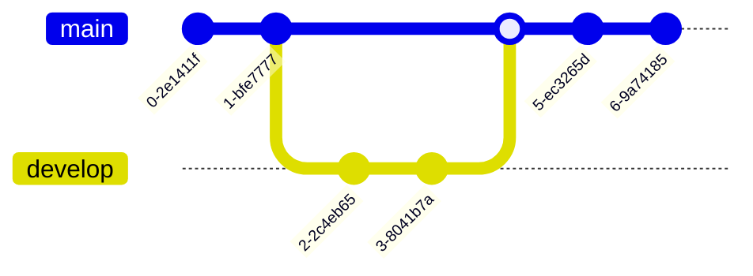

# Your Custom Extension

This is a markdown file.

## [Markdown](https://markdown-it.github.io/)

---

**Advertisement :)**

- **[pica](https://nodeca.github.io/pica/demo/)** - high quality and fast image
  resize in browser.
- **[babelfish](https://github.com/nodeca/babelfish/)** - developer friendly
  i18n with plurals support and easy syntax.

You will like those projects!

---

# h1 Heading 8-)

## h2 Heading

### h3 Heading

#### h4 Heading

##### h5 Heading

###### h6 Heading

## Horizontal Rules

---

---

---

## Typographic replacements

Enable typographer option to see result.

(c) (C) (r) (R) (tm) (TM) (p) (P) +-

test.. test... test..... test?..... test!....

!!!!!! ???? , , -- ---

"Smartypants, double quotes" and 'single quotes'

## Emphasis

**This is bold text**

**This is bold text**

_This is italic text_

_This is italic text_

~~Strikethrough~~

## Blockquotes

> Blockquotes can also be nested...
>
> > ...by using additional greater-than signs right next to each other...
> >
> > > ...or with spaces between arrows.

## Lists

Unordered

- Create a list by starting a line with `+`, `-`, or `*`
- Sub-lists are made by indenting 2 spaces:
  - Marker character change forces new list start:
    - Ac tristique libero volutpat at
    - Facilisis in pretium nisl aliquet
    - Nulla volutpat aliquam velit
- Very easy!

Ordered

1.  Lorem ipsum dolor sit amet
2.  Consectetur adipiscing elit
3.  Integer molestie lorem at massa

4.  You can use sequential numbers...
5.  ...or keep all the numbers as `1.`

Start numbering with offset:

57. foo
1.  bar

# Math Rulez!

$\sqrt{3x-1}+(1+x)^2$

$$
\begin{array}{c}

\nabla \times \vec{\mathbf{B}} -\, \frac1c\, \frac{\partial\vec{\mathbf{E}}}{\partial t} &
= \frac{4\pi}{c}\vec{\mathbf{j}}    \nabla \cdot \vec{\mathbf{E}} & = 4 \pi \rho \\

\nabla \times \vec{\mathbf{E}}\, +\, \frac1c\, \frac{\partial\vec{\mathbf{B}}}{\partial t} & = \vec{\mathbf{0}} \\

\nabla \cdot \vec{\mathbf{B}} & = 0

\end{array}
$$

## Code

Inline `code`

Indented code

    // Some comments
    line 1 of code
    line 2 of code
    line 3 of code

Block code "fences"

```
Sample text here...
```

Syntax highlighting

```js
var foo = function (bar) {
	return bar++;
};

console.log(foo(5));
```

## Tables

| Option | Description                                                               |
| ------ | ------------------------------------------------------------------------- |
| data   | path to data files to supply the data that will be passed into templates. |
| engine | engine to be used for processing templates. Handlebars is the default.    |
| ext    | extension to be used for dest files.                                      |

Right aligned columns

| Option |                                                               Description |
| -----: | ------------------------------------------------------------------------: |
|   data | path to data files to supply the data that will be passed into templates. |
| engine |    engine to be used for processing templates. Handlebars is the default. |
|    ext |                                      extension to be used for dest files. |

## Links

[link text](http://dev.nodeca.com)

[link with title](http://nodeca.github.io/pica/demo/ "title text!")

Autoconverted link https://github.com/nodeca/pica (enable linkify to see)

## Images


Like links, Images also have a footnote style syntax

![Alt text][id]

With a reference later in the document defining the URL location:

[id]: https://octodex.github.com/images/dojocat.jpg "The Dojocat"

## Plugins

The killer feature of `markdown-it` is very effective support of
[syntax plugins](https://www.npmjs.org/browse/keyword/markdown-it-plugin).

### [Abbreviations](https://github.com/markdown-it/markdown-it-abbr)

This is HTML abbreviation example.

It converts "HTML", but keep intact partial entries like "xxxHTMLyyy" and so on.

\*[HTML]: Hyper Text Markup Language

### [Attributes](https://github.com/markdown-it/markdown-it-attr)

paragraph {.style-me data-toggle=modal}

Use the css-module green on this paragraph. {..green}

paragraph with [a style me span]{.red}

```python {data=asdf}
nums = [x for x in range(10)]
```

### [bracketed_spans](https://github.com/markdown-it/markdown-it-bracketed-spans)

foo [bar *bar*]{#id .class attr=value} baz

### [cjk-breaks](https://github.com/markdown-it/markdown-it-cjk-breaks)

#### Remove linebreaks near ZWSP

foo​
bar
​baz

#### Remove linebreaks between hiragana (wide) characters

あおえ
いう

#### Remove linebreaks between halfwidth katakana

ｱｵｴ
ｲｳ

#### Remove linebreaks between fullwidth characters

！＂＃
＄％

#### Keep linebreaks between hangul characters

ㅏㅗㅔ
ㅣㅜ
ￂￌￇ
ￜￓ

#### Keep linebreaks between hiragana (wide) and english

あおえ
aoe
あおえ

#### Emphasis tokens should be skipped

_あおえ_
_いう_

#### Should recognize astral characters correctly

foo 🈀
🈀 foo

### [Definition lists](https://github.com/markdown-it/markdown-it-deflist)

Term 1

: Definition 1
with lazy continuation.

Term 2 with _inline markup_

: Definition 2

        { some code, part of Definition 2 }

    Third paragraph of definition 2.

_Compact style:_

Term 1
~ Definition 1

Term 2
~ Definition 2a
~ Definition 2b

### [Emojies](https://github.com/markdown-it/markdown-it-emoji)

> Classic markup: :wink: :cry: :laughing: :yum:
>
> Shortcuts (emoticons): :-) :-( 8-) ; )

see [how to change output](https://github.com/markdown-it/markdown-it-emoji#change-output) with twemoji.

### [Expand Tabs](https://github.com/markdown-it/markdown-it-expand-tabs)

```
function foo() {
	indentedOne();
	if (bar) {
		// line	with	internal	tabs
		lineWithTrailingTabs();
		indentedTwo();
	}
}
```

### [Footnotes](https://github.com/markdown-it/markdown-it-footnote)

#### Normal footnote:

Footnote 1 link[^first].

Footnote 2 link[^second].

Inline footnote^[Text of inline footnote] definition.

Duplicated footnote reference[^second].

[^first]: Footnote **can have markup**

    and multiple paragraphs.

[^second]: Footnote text.

#### Inline Footnotes:

Here is an inline note.^[Inlines notes are easier to write, since
you don't have to pick an identifier and move down to type the
note.]

### [Highlightjs](https://github.com/valeriangalliat/markdown-it-highlightjs)

#### raw indented code block

    console.log(42);

#### fenched code block

```js
console.log(42);
```

#### auto

```
<?php echo 42;
```

#### inline with Pandoc format

`console.log(42)`{.js}

#### inline with kramdown format

`console.log(42)`{:.js}

## HTML

```html
<!DOCTYPE html>
<html>
	<head>
		<title>Page Title</title>
	</head>

	<body>
		<h1>This is a Heading</h1>
		<p>This is a paragraph.</p>
	</body>
</html>
```

### [\<ins>](https://github.com/markdown-it/markdown-it-ins)

++Inserted text++

## Lazy Headers

#foo
##foo
###foo
####foo
#####foo
######foo

### [\<mark>](https://github.com/markdown-it/markdown-it-mark)

==Marked text==

### [Subscript](https://github.com/markdown-it/markdown-it-sub) / [Superscript](https://github.com/markdown-it/markdown-it-sup)

- 19^th^
- H~2~O

## GFM task list

- [x] GFM task list 1
- [x] GFM task list 2
- [ ] GFM task list 3
  - [ ] GFM task list 3-1
  - [ ] GFM task list 3-2
  - [ ] GFM task list 3-3
- [ ] GFM task list 4
  - [ ] GFM task list 4-1
  - [ ] GFM task list 4-2

### [Custom containers](https://github.com/markdown-it/markdown-it-container)

::: warning
_here be dragons_
:::

## [mermaid](https://mermaid.live/)

### Flow


### Sequence


### Class


### State


### ER


### Gantt


### UserJourney


### Git



### Pie


### Mindmap


### QuarrantChart


### XYChart


### Block


## [pug](https://github.com/pugjs/pug)

```pug
doctype html
html(lang="en")
  head
    title= pageTitle
    script(type='text/javascript').
      if (foo) bar(1 + 5);
  body
    h1 Pug - node template engine
    #container.col
      if youAreUsingPug
        p You are amazing
      else
        p Get on it!
      p.
        Pug is a terse and simple templating language with a
        strong focus on performance and powerful features.
```

## [rst](https://www.tutorialspoint.com/online_restructure_editor.php)

```rst
=====
Title
=====

This is a paragraph.

Paragraphs contain text and may contain inline markup: *emphasis*, **strong emphasis**, \`\`inline literals\`\`.

Bullet Lists
------------

- A bullet list

  - Nested bullet list
  - Nested item 2.

- Item 2.

  Paragraph 2 of item 2.

  - Nested bullet list.

Enumerated Lists
----------------

01. A enumerated list
02. Item 2.

Definition Lists
----------------

Term
  Definition

Term
  Definition paragraph 1.

  Definition paragraph 2.

Literal Blocks
--------------

::

  console.log('Hello, world!');

Line Blocks
-----------

| A one, two, a one two three four
|
| Half a bee, philosophically,
|   must, ipso facto, half not be.

Block Quotes
------------

Block quotes consist of indented body elements:

  My theory by A. Elk. Brackets Miss, brackets.
  This theory goes as follows and begins now.
  All brontosauruses are thin at one end, much much thicker in the middle and then thin again at the far end.
  That is my theory, it is mine, and belongs to me and I own it, and what it is too.
```
